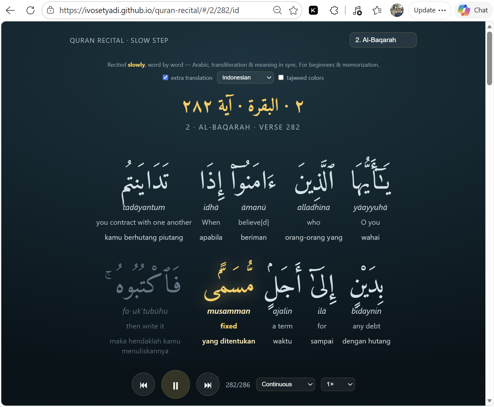
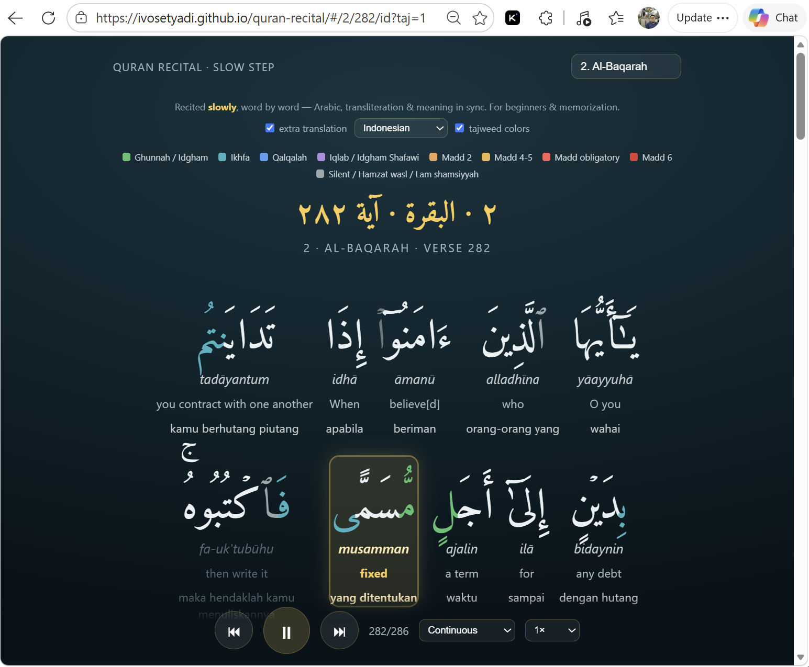

# Quran Recital — Slow Step

Slow, word-by-word Quran recitation with **synced highlighting**. Each Arabic word shows its
**transliteration** and **meaning** directly beneath it (interlinear) and lights up as it is
recited — with optional **tajweed colour-coding** and **extra translations**. Built for
learning and memorization (hifz).

Click play on a surah and the page recites it slowly, lighting up each word as it's read.
Tap any word to jump to it. All 114 surahs. No app, no download — it runs in the browser.

**Live:** https://ivosetyadi.github.io/quran-recital/



## Features
- Interlinear word-by-word highlight (Arabic + transliteration + meaning) synced to the audio
- **Tajweed colours** — optional colour-coding of the Arabic by recitation rule (ghunnah,
  ikhfa, qalqalah, iqlab, madd, silent letters…) with a legend; the recited word is boxed so
  the colours stay visible
- Optional **extra per-word translation** (Indonesian, Urdu, Bengali, Turkish, Persian, Hindi,
  Tamil) — shown as an extra line under each word
- All 114 surahs
- Tap a word to jump & replay from there
- Previous / next ayah
- Playback mode: **Continuous** (ayah → ayah → next surah), **Repeat ayah**, **Repeat surah**,
  or **Stop after ayah**
- Speed control (0.75× / 1× / 1.25×)
- Shareable deep links — surah/ayah, plus language and tajweed state: `#/2/282/id?taj=1`



## How it works
- Pure static site — HTML + CSS + vanilla JS, no backend, no build step.
- **Text & per-word timing**: bundled JSON in `data/{NNN}.json` (from the
  [Quran.com API](https://quran.com/api)), with a `manifest.json` listing all surahs.
- **Tajweed**: per-word tajweed markup bundled in `data/tajweed/{NNN}.json` (Quran.com),
  loaded on demand; coloured via CSS per rule.
- **Extra translations**: per-word glosses bundled in `data/wbw/{lang}/{NNN}.json`, loaded on
  demand.
- **Audio**: streamed from a public CDN, not stored in this repo. Primary
  `cdn.islamic.network` (fast); falls back to everyayah.com / quranicaudio mirror on error.
- **Sync**: on each animation frame, the active word is the one where
  `start ≤ audio.currentTime×1000 < end`.
- **Reciter**: Mahmoud Khalil al-Husary (Murattal) — slow and clear, recites each ayah once.

## Run locally
Any static server, e.g.:
```
npx serve .
# or
python -m http.server
```
Then open the printed URL.

## Data
`data/{NNN}.json` (one per surah) + `data/manifest.json`. Regenerated by
`fetch-web.mjs` in the companion generator repo (bulk `by_chapter` fetch, no audio download).

## Credits
- Quran text, per-word translation & timing: Quran.com
- Recitation audio: Mahmoud Khalil al-Husary, via everyayah.com
- Arabic font: Amiri Quran (Google Fonts)

## License
Code: MIT. Quran text and recitation audio belong to their respective sources — please
respect their terms.
